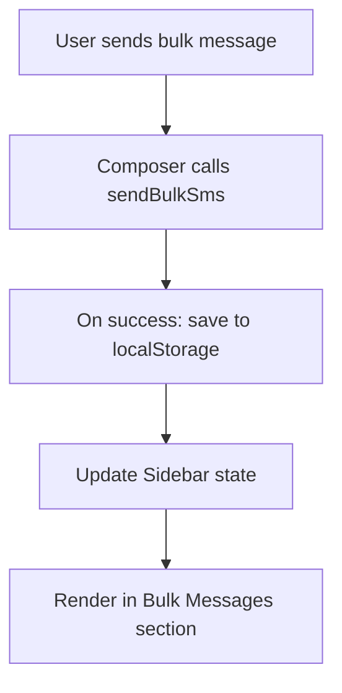

# Bulk Message History Implementation Plan

## Overview
Add a "Bulk Messages" section in the sidebar that displays the history of bulk SMS campaigns, similar to how "Direct Messages" shows individual contacts.

## Current State Analysis

### Sidebar Structure
- Navigation items: Compose, Contacts, Templates
- Activity Feed: "Direct Messages" section showing contacts with last message preview
- Each contact item shows: avatar, name, last message, timestamp

### Bulk Message Flow
- Composer component has `composeMode` ("single" | "bulk")
- `bulkSelectedContacts` tracks selected recipients for bulk sends
- `sendBulkSms()` API function sends to multiple recipients
- No history tracking exists

## Implementation Steps

### Step 1: Create Type Definition
**File:** `src/types/Sms.ts`

Add new type for bulk message history:
```typescript
export interface BulkMessageHistoryItem {
  id: string;
  message: string;
  recipientCount: number;
  timestamp: string;
  status: 'sent' | 'partial' | 'failed';
}
```

### Step 2: Create Storage Utility
**File:** `src/utils/storage.ts` (new file)

Add functions to persist and retrieve bulk message history:
- `saveBulkMessage(item)`: Save to localStorage
- `getBulkMessageHistory()`: Retrieve from localStorage
- `clearBulkMessageHistory()`: Clear history

### Step 3: Update Sidebar Component
**File:** `src/components/Sidebar.tsx`

1. Import the new type and storage utility
2. Add state for bulk message history with localStorage loading
3. Add "Bulk Messages" section below "Direct Messages"
4. Display each bulk message with:
   - Icon (group icon instead of individual avatar)
   - Message preview (truncated)
   - Recipient count
   - Timestamp

### Step 4: Update Composer Component
**File:** `src/components/Composer.tsx`

1. Import storage utility
2. After successful `sendBulkSms()`, save to bulk message history
3. Pass bulk history updates to parent or store in accessible location

### Step 5: Update App/Dashboard
**File:** `src/App.tsx` or `src/pages/Dashboard.tsx`

Pass bulk message history to Sidebar component

## UI Design

### Sidebar Layout (Proposed)
```
+---------------------------+
|  Compose  |  Contacts    |
|  Templates |              |
+---------------------------+
|  DIRECT MESSAGES (3)      |
|  [Avatar] John Doe        |
|         Hello there...    |
|  [Avatar] Jane Smith      |
|         Meeting at 2pm    |
+---------------------------+
|  BULK MESSAGES (2)        |
|  [Group] Campaign #1      |
|         50 recipients     |
|  [Group] Announcement     |
|         25 recipients     |
+---------------------------+
|  Settings                 |
+---------------------------+
```

### Bulk Message Item
- Icon: Group icon (FiUsers) instead of avatar initials
- Title: First 30 chars of message or "Bulk Message"
- Subtitle: "{count} recipients"
- Timestamp: Relative time (e.g., "2m ago", "1h ago")

## Data Flow



## Files to Modify
1. `src/types/Sms.ts` - Add type definition
2. `src/utils/storage.ts` - Create storage utility (new file)
3. `src/components/Sidebar.tsx` - Add UI section
4. `src/components/Composer.tsx` - Hook up history saving
5. `src/App.tsx` - Pass data to Sidebar

## Acceptance Criteria
1. Sidebar shows "Bulk Messages" section when there are history items
2. Each bulk message shows: preview text, recipient count, timestamp
3. History persists across page refreshes (localStorage)
4. New bulk messages appear in history after sending
5. Clicking a bulk message item navigates to compose with that message
